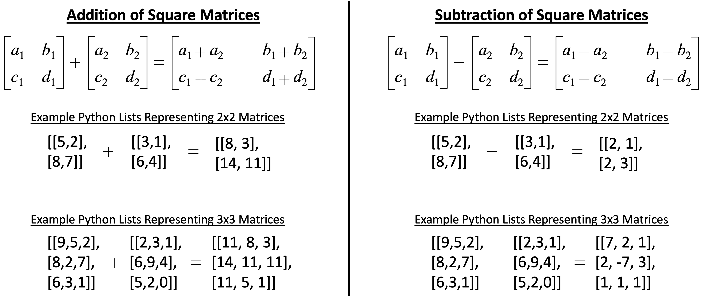

# Exam 1

## Rules of Behavior
1. Do not communicate with anyone during the exam (no email, no social media, no Discord, no texting, no phones, no talking, no passing notes, no internet communicating).  If there is any evidence of communicating with anyone during the exam you will receive a zero.
1. You **must** turn off your cell phone and store it away.
1. Your submission **must** be solely you own work without the assistance of anyone by any means.
1. All programming code **must** be written in Python.
1. You **must** use Tuffix to unit test your program.
1. All your code **must** be pushed to Github by the scheduled end of class today.  Any submissions after that time will not be considered.
1. You may use your book.
1. You may use the Internet as a **reference only**.
1. If you have questions, approach the instructor desk.

## Getting Started
1. Open the Terminal program in Tuffix.
1. Change the present working directory to the `Documents` directory by typing the following command at the command prompt:

    ```
    cd Documents
    ```

1. Make a copy of this Github repository on your computer using the `git` and `clone` commands that you will input to the terminal. The commands take a URL as a parameter to specify where it can get a copy of the repository. You can find the URL by clicking on the green *Clone or download* button at the top right part of this page. Copy the URL and replace the example text shown below. Note that `username` should be replaced with your own Github username. When you hit <kbd>Enter</kbd> it will ask you to provide your Github username and token. Once done, you will have a copy of the repository on your computer.
    ```
    git clone https://github.com/CSUF-CPSC223P-STMAY-2023S/exam01-username.git
    ```
1. Navigate into the new directory using the command line. Note that `username` should be replaced with your own Github username.  As a shortcut, you can type the first few letters of the folder name and press <kbd>Tab</kbd> so that it auto completes the folder name for you.

     ```
     cd exam01-username
     ```

## Program Instructions
1. Write a Python module that adds and subtracts square matrices of any size.  A square matrix is where the number of rows equals the number of columns.  The size of the square matrix is the number of elements in either a row or a column. 

<p align="center">
  
</p>

1. Create a `simplematrix` module to meet the following requirements:
     1. Create a file named `simplematrix.py`.
          1. Define a function named `matrix_math` to meet the following requirements:
               1. Accept a keyword only argument named `matrix_a` which is set to the default value of an empty list.
               1. Accept a keyword only argument named `matrix_b` which is set to the default value of an empty list.
               1. Accept a keyword only argument named `mode` which is set to the default value of the string `"add"`.
               1. If `matrix_a` is not a square matrix (i.e. the number of rows equals the number of columns) or the elements of the matrix are not integers, return a `False` value.
               1. If `matrix_b` is not a square matrix or the elements of the matrix are not integers, return a `False` value.
               1. If the size of `matrix_a` is not the same size as `matrix_b`, return a `False` value.
               1. If the value of `mode` is equal to the string `"add"`, return a new list which is the result of adding `matrix_a` to `matrix_b`.
               1. If the value of `mode` is equal to the string `"subtract"`, return a new list which is the result of subtracting `matrix_b` from `matrix_a`.
1. While the main.py file does not need to be submitted and will not be graded, I strongly suggest you create your own very simple main.py file to create the object instance and make all the function calls with various data, to test the return strings and the dictionary of data.

    ```
    python3 -m main
    ```

1. Run the unit testing program to ensure that your program runs as expected.

    ```
    ./test.sh
    ```

    The unit testing will output the results of a series of tests using specific input and expected output.  Any error will provide information on where the expected output is different from the actual output.  You will need to edit your source code to fix the error and run `./test.sh` repeatedly until it passes all the test.

## Submission
Periodically throughout the exercise, and when you have completed the exercise, **submit the complete repository to Github**.

   <pre>git add .<br>git commit -m "<i>your comment</i>"<br>git push</pre>

In case it asks you  to configure global variables for an email and name, just copy the commands it provides then replace the dummy text with your email and Github token.

   <pre>git config --global user.email "<i>tuffy@csu.fullerton.edu</i>"<br>git config --global user.name "<i>Tuffy Titan</i>"<br>git commit -m "<i>your comment</i>"<br>git push</pre>

When you completed the final Github push, go back into github.com through the browser interface and ensure all your files have been correctly updated.  You should have the following files:
```
simplematrix.py
test.txt
```

## Grading
1. All points add up to a total of 100 points possible as detailed below.  Partial credit will be given where applicable.

| Points | Description |
| --- | --- |
|50|initial git clone of this repository to your Tuffix machine|
|14|simplematrix.py file submitted and meets the program requirements |
|4|unit test passes Test01_Add2x2_Valid|
|4|unit test passes Test02_Add3x3_Valid|
|4|unit test passes Test03_Subtract2x2_Valid|
|4|unit test passes Test04_Subtract3x3_Valid|
|4|unit test passes Test05_MatrixA_NotSquare|
|4|unit test passes Test06_MatrixA_NotInt|
|4|unit test passes Test07_MatrixB_NotSquare|
|4|unit test passes Test08_MatrixB_NotInt|
|4|unit test passes Test09_MatrixA_MatrixB_NotSameSize|
